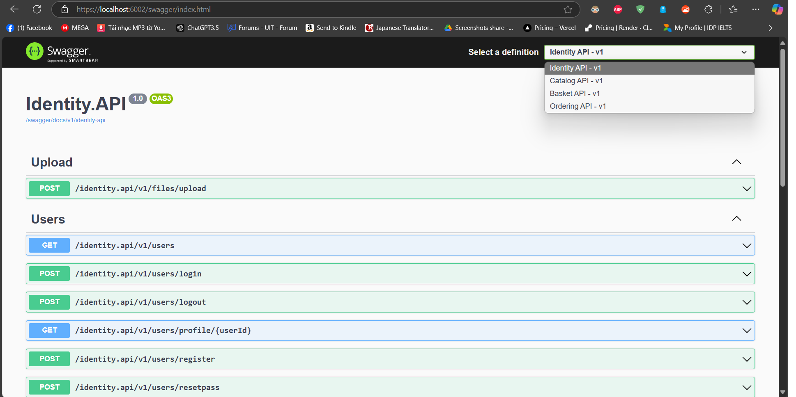

# Bookstore Backend Microservice

### To view the repo containing the frontend of this project, please follow this [link](https://github.com/4nh3k/BookStoreFE).

A Bookstore E-Commerce website based on Microservice Architecture using .NET.

## Features
- A Catalog API for CRUD operations on book products.
- An Identity API & JWT authentication for Authentication & Authorization.
- An Order API server for handling order requests
- A Basket API built by Redis & .NET for caching user's cart.
- A simple recommendation API suggesting books which are similar to the book selected.

## Installation
1. Clone the repository
 `git clone https://github.com/4nh3k/BookStore.git`
2. Open the terminal in project root and change directory to src folder using: cd src
3. Build the project using the command: docker-compose build
4. After the build is completed, run the containers by running: docker-compose up -d
5. Open the backend server gateway using the url: https://localhost:6002/swagger/index.html (don't use the url contain port 6001 since it is http)
6. For the Order & Basket API to run, please login through the login api in the Identity API and assign the JWT token to the bearer in these APIs (account: admin admin)
